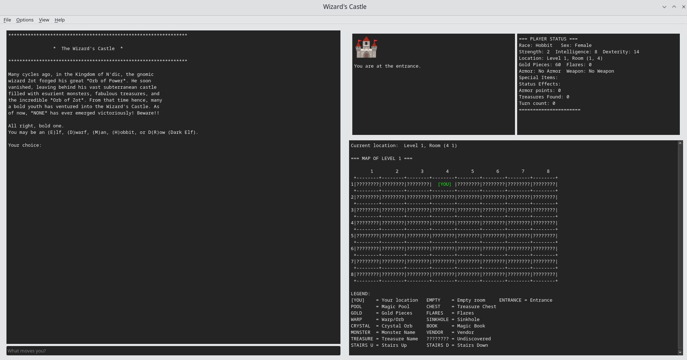

# 🏰 Wizard's Castle: A Perilous Quest for the Orb of Zot



## 🧙‍♂️ Embark on an Epic Text-Based Adventure!

Brave adventurer, dare you enter the **Wizard's Castle**? This legendary dungeon crawler, reimagined for modern systems, beckons you to dive into a realm of magic, monsters, and mystery. Your ultimate goal? To claim the fabled **Orb of Zot**!

### 🗺️ Project Overview

This repository is your gateway to multiple realms of the Wizard's Castle:

- **🏆 C Implementation (Fully Functional)**: The crown jewel, located in the `c/` directory. Prepare for the complete, playable adventure!
- **🐍 Python Implementation (Work in Progress)**: A fledgling attempt in the `python/` directory. While currently non-functional, it offers a glimpse into an alternate reality. *Note: Not suitable for gameplay.*
- **📜 Original BASIC Source**: For the purists, find the classic version in `original_source/`. Compatible with Quick Basic 7.1.
- **✨ Refactored BASIC Source**: Discover a polished rendition of the BASIC code in `refactored_source/`.

### ✨ Features That Await You

- **📖 Immersive Text-Based Gameplay**: Experience the thrill of old-school RPGs with modern twists.
- **🎲 Randomly Generated Castles**: Every game promises a unique adventure with 🗺️ 512 rooms to explore; each with 🐻 Monsters, 🧞 Vendors, 🪄 Rune staff, 💰 Gold, ⚡ Flares, 💎 Mystical Treasures, and more.
- **🧝‍♂️ Diverse Character Races**: Choose your alter ego - 👤 Human, 🧝 Elf, 🧑 Hobbit, 🧔 Dwarf,  or a 🧛 Dark Elf (Drow) - each with unique traits.
- **⚔️ Strategic Combat**: Face fearsome foes from sneaky Kobolds to mighty Dragons 🐉. Use your wits and weapons wisely!
- **🔮 Magic and Mystery**: Cast powerful spells 🪄, drink from enchanted pools 🌊, and uncover ancient treasures 💎.
- **💰 Vendor Interactions**: Barter with the castle's enigmatic merchant. What secrets might they hold?
- **🗺️ ASCII Map**: Navigate the treacherous castle with a clear, retro-style map display.

### 🚀 Getting Started

#### 🔮 Prerequisites

- GCC compiler (your trusty sword ⚔️ )
- Make build system (your faithful shield 🛡️)

#### Installation

1. Clone the repository (summon the game to your realm):
   ```
   git clone https://github.com/jasonbrianhall/wizardscastle.git
   ```
2. Enter the C implementation chamber:
   ```
   cd wizardscastle/c
   ```
3. Forge the game:
   ```
   make
   ```
4. For those daring to explore realms beyond the world of Zot, you may summon the powers of alternate universes:

🧬 To craft an artifact for the kingdom of Windows:
   ``` 
   make windows 
   ```

Or, to invoke the ancient MS-DOS spell (:
   ``` 
   make msdos
   ```

But take heed, brave adventurer—these rituals draw upon the power of Docker, and only a properly prepared Docker system will channel the magic required.


For those venturing into the realm of MS-DOS, it is highly recommended to first equip yourself with the forgotten relic known as vmode. Retrieve it from the archives here: [vmode.exe](https://mendelson.org/wpdos/vmode.exe)

Once acquired, invoke its power with:

```
vmode 0x54
vmode 0x11
vmode 0x12
```

These configurations are known to work well with the mystical DOSBox, aligning the stars of your display for a smoother adventure.

Should your quest demand further arcane knowledge of display configurations, additional video modes may be discovered in this ancient tome: [PC Video Modes](https://cs.lmu.edu/~ray/notes/pcvideomodes/)

Only then will the mystical display align itself for your journey.

5. Summon the Power of the RPMs

For those brave enough to wield the mystical forces of package management, you may call upon the ancient command:

```
make rpm
```

🎁 Watch in awe as your system transforms the humble source code into a shiny RPM package, ready for distribution! This command is akin to casting a spell; just be sure to have your potion ingredients (a.k.a. dependencies) at the ready.

Warning: Engaging in this sorcery may result in unanticipated magical side effects, such as:

    Unexpected Dependencies: You might find your system craving libraries it never knew it wanted.
    Missing Debug Symbols: Fear not! The great and powerful compiler may forget to add those elusive symbols, leaving your debugging attempts as effective as a spell with no target.
    Ghostly Messages: If you hear the distant echoes of error or warning, do not be alarmed! These are merely the spirits of the code reminding you to pay attention.

So grab your staff (or keyboard), and may the RPM gods smile upon your endeavor!


6. Summon the GUI version (Linux wizards only):

```
make qt
```

🎨 Behold! The Wizard's Castle now appears in glorious technicolor! (Well, at least more colors than just white-on-black; also supports green on black among other color combinations.)

⚠️ Warning: This enchantment currently only works in the realm of Linux. We're still deciphering the arcane scrolls needed to make it appear in the Windows dimension. Stay tuned, Windows wizards.

⚠️ Arcane Warning for Windows Wizards: While the spell to create the Windows artifact (executable) can be cast (make qt-windows), the resulting enchantment is unstable. It requires a hefty grimoire of DLL scrolls (over 300MB!) and may still grumble about missing components of the Qt realm. We're working on a more potent incantation to condense this magic into a single, portable artifact. Until then, Linux remains the most stable dimension for this particular enchantment. Fear not, for we continue our mystical research!

🎨 For Windows wizards, fear not! The ancient automatons of GitHub's mystical forges craft your artifacts through their arcane CI rituals. These enchanted binaries, complete with their own magical essences (all external DLLs included!), appear in the sacred releases chamber. While the ASCII runes may appear simplified in the Windows realm (emojis), they retain their mystical potency.

#### Embarking on Your Quest

Launch your adventure:
```
./wizardscastle
```

For those seeking an easier path or to test uncharted territories:
```
./wizardscastle --debug
```

### 🕹️ How to Play

- Use single-letter commands to navigate and interact with the castle.
- Explore mysterious rooms, battle fierce monsters, decipher ancient books, and more!
- Manage your resources wisely - gold, flares, and health are your lifelines.
- Your ultimate goal: Find the Orb of Zot and escape the castle victorious!
- Type `H` for a list of available commands.


- Type `M` to reveal a map of your current level (unexplored rooms remain shrouded in mystery).


### 🛠️ Development

Want to contribute to the legend? Here's how to set up your enchanted dev environment:

1. Ensure you have GCC and Make installed in your realm.
2. Fork and clone the repository to your local dimension.
3. Weave your magic in the source files within the `c/` directory.
4. Use `make debug` to create a debug build with AddressSanitizer, your mystical debugging ally.

### 📚 The Great Archives (Documentation)

For those seeking ancient lore about the game's arcane mechanics, sacred commands, and secrets of development, journey to our [Great Archives](WIKI.md). Like the libraries of Gondor, these scrolls contain wisdom passed down through the ages.

### 🤝 The Fellowship of Contributors

We welcome fellow enchanters to join our quest! Please consult the [Contributor's Covenant](CONTRIBUTING.md) for details on our code of conduct and the sacred ritual for submitting pull requests. Together, we shall forge a legend to rival the tales of old!

### 📜 License

This project is safeguarded by the Sacred Scroll of MIT, a powerful enchantment that grants rights and protections to all who encounter this code. The scroll is guarded by the fierce dragon Licensora, whose flames ensure the terms are forever honored. Brave souls who wish to understand their rights and responsibilities may approach the LICENSE.md chamber, but beware - the dragon's watchful eyes never close!

See the [LICENSE](LICENSE.md) scroll for details.

### 🙏 Acknowledgments

- Original concept based on the 1980 BASIC game "Wizard's Castle" by Joseph R. Power
- Inspired by classic text adventures and roguelikes that have captivated adventurers for generations

### 🧙‍♂️ Author

🧛 Jason Hall (jasonbrianhall@gmail.com)

**Note:** Please respect the author's privacy and refrain from sending unsolicited messages via carrier pigeon or magical means.

### 🔮 Future Quests

- NES and SNES versions (for the retro-conjurers among us)
  * NES is unlikely since limited to 2k of RAM (and the use of numbers larger then 256) but but the 64k of RAM on the SNES is a better target (and 16 bit integers)
- Perhaps a Mobile Version (for adventuring on-the-go)

Brave soul, the Wizard's Castle awaits! Will you emerge victorious with the Orb of Zot, or fall to the castle's many perils? Your legend begins now!

### 📚 Find us on sourceforge

https://sourceforge.net/projects/wizards-castle

---

🏷️ Keywords: text-based game, roguelike, dungeon crawler, C programming, BASIC, retro gaming, ASCII graphics, RPG, fantasy adventure, open-source game
