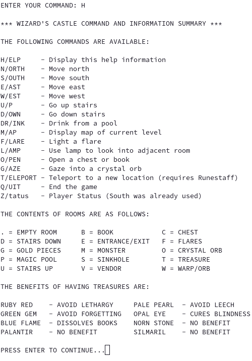
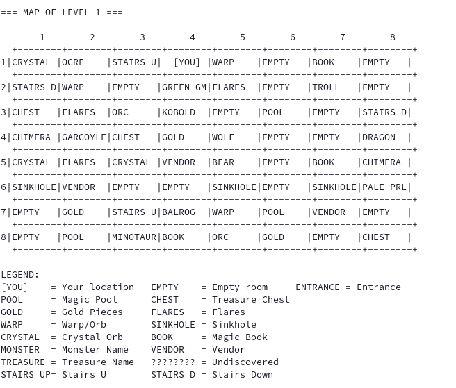

# Wizard's Castle


## Journey into the Mystical Realm of Zot

Embark on an epic text-based adventure in **Wizard's Castle**, a classic dungeon crawler reimagined for modern systems. Dive into a world of magic, monsters, and mystery as you search for the legendary Orb of Zot!

### Features

- **Immersive Text-Based Gameplay**: Experience the thrill of old-school RPGs with modern enhancements.
- **Randomly Generated Castles**: Every game is a unique adventure with 512 rooms to explore.
- **Multiple Character Races**: Choose from Humans, Elves, Hobbits, and Dwarves, each with unique attributes.
- **Strategic Combat**: Face fearsome creatures from Kobolds to Dragons, using your wits and weapons.
- **Magic and Mystery**: Cast spells, drink from enchanted pools, and uncover ancient treasures.
- **Vendor Interactions**: Buy, sell, and barter with the castle's enigmatic merchant.
- **ASCII Map**: Navigate the castle with a clear, retro-style map display.

### Getting Started

#### Prerequisites

- GCC compiler
- Make build system

#### Installation

1. Clone the repository:
   ```
   https://github.com/jasonbrianhall/wizardscastle
   ```
2. Navigate to the project directory:
   ```
   cd wizards-castle/c
   ```
3. Compile the game:
   ```
   make
   ```

#### Playing the Game

Run the compiled executable:
```
./wizardscastle
```

For an easier experience and to test broken code, try the debug mode:
```
./wizardscastle --debug
```

### How to Play

- Use single-letter commands to navigate and interact with the castle (exception being DRink which allows you to drink from a pool).
- Explore rooms, fight monsters, read books, explore chests, trade with vendors, and collect treasures.
- Manage your resources wisely - gold, flares, and health are crucial!
- Find the Orb of Zot and escape the castle to win!
- Type in H for a list of available commands



- Type in M for a map of the current level (unexplored rooms will be hiddne)




### Development

Want to contribute or modify the game? Here's how to set up your dev environment:

1. Ensure you have GCC and Make installed.
2. Fork and clone the repository.
3. Make your changes in the source files.
4. Use `make debug` for a debug build with AddressSanitizer enabled.

### Contributing

We welcome contributions! Please read our [Contributing Guide](../CONTRIBUTING.md) for details on our code of conduct and the process for submitting pull requests.

### License

This project is licensed under the MIT License - see the [LICENSE](../LICENSE.md) file for details.

### Acknowledgments

- Original concept based on the 1980 BASIC game "Wizard's Castle" by Joseph R. Power
- Inspired by classic text adventures and roguelikes

### Future Plans

- RPM package support (coming soon!)
- NES and SNES versions
- Maybe a Mobile Version

Dive into the Wizard's Castle today and claim the Orb of Zot! Will you emerge victorious, or fall to the castle's many perils? Your adventure awaits!

---

Keywords: text-based game, roguelike, dungeon crawler, C programming, retro gaming, ASCII graphics, RPG, fantasy adventure, open-source game
